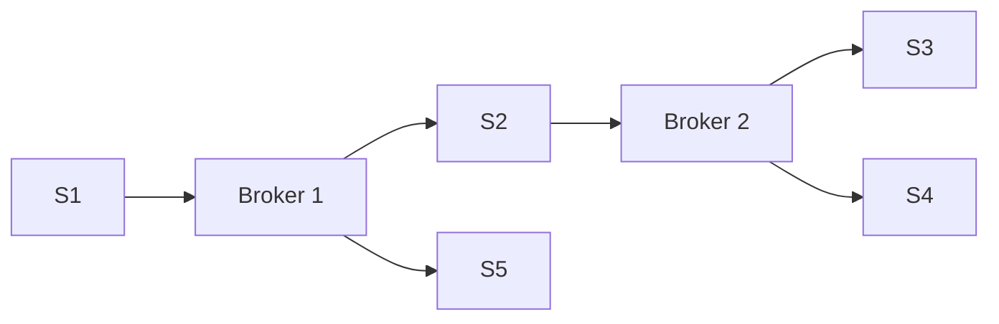
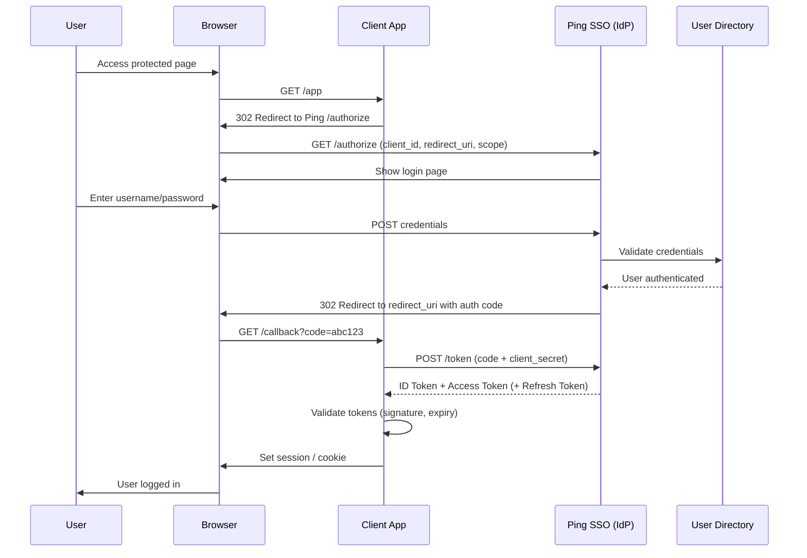

Is Consistent Hashing really used?

Consistent Hashing

- **Hash space as a ring:**  
    Imagine the hash values of keys and servers laid out on a circle ("hash ring").
    
- **Node placement:**  
    Each server node is assigned one or more positions on the ring based on a hash of its ID. 
    We can maintain multiple hash functions for servers let's say K, Now we have K-1 extra virtual servers's whose load would be directed to one server. It helps evenly distribute the Hash space
    
- **Key assignment:**  
    Hash the key and find the _next_ server clockwise on the ring — that server handles the key.
    
- **Minimal remapping:**  
    When a server joins or leaves, only the keys that mapped near that node need to move.

**Monolith**
Scales Out
Lesser Moving Parts
Deployments are easy
This is faster - No Network Calls (RPC)
If new member joins, they need to understand E2E
High Coupling
Too Much Responsibility On Each Server

**Microsevices**
Easier to scale
Each concerned with it's data
If new member joins, they just need to know context of that service.
Parallel Development is easier
Not Easy to design
If Service1 is only talking to Service2 then probably they could have been part of single service.

---
**Caching**

Bad When Queries are in sequential repeatable pattern

1 2 3 4 1 2 3 4 1 2 3 4 Cache Size 3

**CDN**

Servers distributed over different Regions of the world. So as to reduce load time, follow regulations.
CDN works best when data rarely changes so as to have maximum cache hit.
Mostly stores static data.

### Event Driven

Does a lot of Decoupling

More Scalable
No Idempotency/Atomicity

**Sharding**: Method of distributing data across multiple machines (DB). It is at DB level
**Partitioning**: Spliting a subset of data with same instance. It is at DATA level

| Advantages of Sharding  | Dis-advantages of Shrading                                                                                                                  |
| ----------------------- | ------------------------------------------------------------------------------------------------------------------------------------------- |
| Scaling out is feasible | Cross Shard Queries are expensive w.r.t time, complexity, code                                                                              |
| Higher Availability     | Overall handling is complex.   Read Replica: Continuously do writes of one DB to it's replicas Shard+Partition: Load Balancing  |
|                         |                                                                                                                                             |

---

SQL vs NoSQL

| SQL                      | NoSQL                                                    |
| ------------------------ | -------------------------------------------------------- |
| Very strict with schema. | Flexible with schema                                     |
|                          | Horizontal Partitioning is inbuilt, Built for scale      |
|                          | Insertion, retriveal is easier                           |
|                          | Not built for updates                                    |
|                          | ACID is not guarenteed                                   |
|                          | Not read optimized, slower read time                     |
| Built For Joins          | Cann't put a constraint like foreign key. Joins are Hard |

---
API Design:

An api should not have side affects. (Doing more than it's name)
When response is huge and we want to reduce response size/ reduce api response time.
2 things can be done.
1. Pagination
2. Fragmentation

